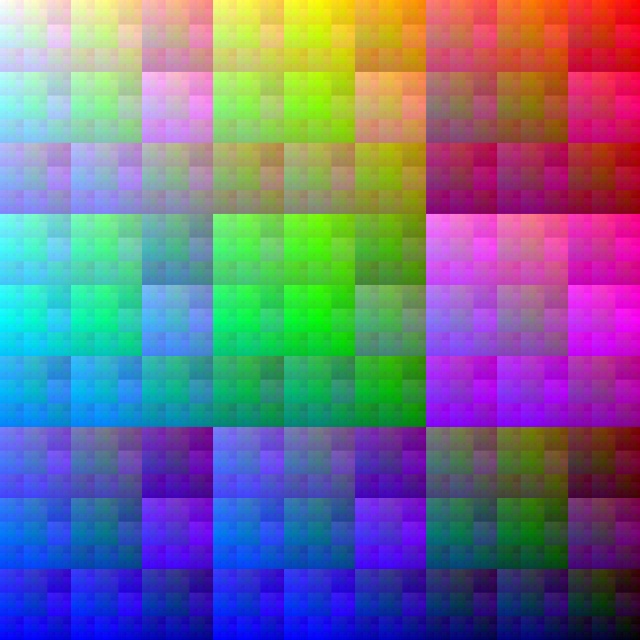

# Task 01-AllTheColors
Your task is to write a **C# command-line** program which creates a PNG image
with **all RGB colors** in it. That means it must have at least
256 * 256 * 256 = 2^24 = 16M pixels.

* The pixel colors can be repeated, but no color from the 16M set can be missing!
* Your program should have several modes:
  * **trivial mode** using as simple implementation as possible
  * **random mode** (chaotic mode) where you cannot recognize any pattern
    in the result image
  * **ornament or pattern mode** where you try to implement any visually
    appealing ornaments or patterns (based on repetition, mandala-like,
    etc.)
* In any case, your image **must have all 2^24 RGB colors!**
* The program should use simple **command-line arguments** defining desired
  image size, image file name, mode and random seed if relevant for the mode (see
  the next section for exact format of the arguments)
  * In case of image size smaller than 16M pixels program must write an error
    message (starting with `ERROR`) to the **standard output** and abort without
    generating an image
  * In any non-standard circumstances, your program should print an message (`ERROR ...`)
    to the standard output. Please don't use exceptions.

# Command-line arguments

You have to implement the four (`-w, -h, -o, -m`) arguments, only
short versions will be used while testing your solution.

| short | long | description | mandatory |
| -------- | -------- | ------------------------ | -------- |
| -w \<int\> | --width \<int\> | Image width in pixels | No |
| -h \<int\> | --height \<int\> | Image height in pixels | No |
| -o \<filename\> | --output \<filename\> | Output file-name (*.png) | No |
| -m \<mode\> | --mode \<mode\> | Mode is "trivial", "random" or "pattern" | No |
| -s \<int\> | --seed \<int\> | Random seed for the "random" mode | No |

Any other meaningful parameters can be implemented, provided they are adequately
documented.

## Notes
You should use `.NET 8` which is available on Windows, macOS and Linux.

### Image library
Using of a simple image processing library is recommended. My option would
be [SixLabors.ImageSharp](https://www.nuget.org/packages/SixLabors.ImageSharp/).
You can create an image just writting
```csharp
  var image = new Image<Rgba32>(width, height);
```
  Than you can set pixel colors as easy as
```csharp
  var color = new Rgba32((byte)0, (byte)255, (byte)100);
  image[x, y] = color;
```
  And finally you can save the image using
```csharp
  image.Save("output.png");
```
### Command-line parsing
For the parsing of command-line arguments I'd recommend
[CommandLineParser](https://www.nuget.org/packages/CommandLineParser/).
It is wise to have reasonable default settings, you can reduce debugging time.

Don't forget to include several reasonable examples in your documentation,
to show everything your program can do (see the section **Examples** in your
documentation).

# Your solution
Please place your solution in a separate [solutions](solutions/README.md)
directory in the repository. You'll find short instructions there.

# Launch date
**Friday 10 October 2025**
(Don't work on the solution before this date)

# Deadline
See the shared [point table](https://docs.google.com/spreadsheets/d/17XuX5tgvh_E0u17Y4BXtQK-qVt1qnr9zAXVHGkYrNWs/edit?usp=sharing).

# Credit points
**Basic solution: 8 points**
* all images must contain 16M colors
* image size in pixels via arguments (`-w, -h`)
* output file name specified in an argument (`-o`)
* mode selection by command line argument (`-m`)
* at least three modes: `trivial`, `random`, `pattern` (pattern could be simple and static)

**Bonus points: up to 6 more points**
* more patterns (parametrizable, visually more appealing)
  * "mandala" style (circular symmetry)
  * "ornament" could use a recursive pattern or another sort of repetition...
* more command-line arguments

## Use of AI assistant
Recommended but not rewarded. Only in exceptional cases, if working with
an assistant would lead to interesting progress or unexpected results,
extra points may be awarded.

# Pilot version
We have included a pilot version of the project, which is not able to generate a 16M
color image, but it shows the use of the `SixLabors.ImageSharp` library
to create and save a PNG image with a blue-red checkerboard.

The code was recommended by a `ChatGPT` assistant,
the whole conversation is archived [here](https://chatgpt.com/share/66f7db02-7af4-8000-a968-f817fb3b891c).

# Example
This image is downsampled, so it doesn't contain enough colors to meet
the requirements of the task!


