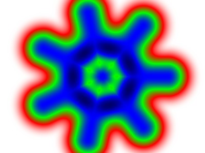

# Task 04-Mandala
Your task is to implement **Mandala-like** drawing algorithms. You should write a command line
program that draws mandalas without user interaction and saves them to a disk file.

Our **definition of a mandala**: an image with distinct **circular symmetry**. The order of
symmetry is usually 5 to 12, giving angles of 72 to 30 degrees.
Of course, you can use multiple symmetry, which can be seen in
Asian mandalas as well.

## Ideas
A. You can draw pixel by pixel or use **drawing routines** from the
[ImageSharp.Drawing library](https://www.nuget.org/packages/SixLabors.ImageSharp/).
If you draw the same "batch" of figures several times with different
rotation around the center of the image, you almost have it (you will probably have to fix
the overlap of the 1st and the last batch).

B. The second idea is to create an **"image function"** that includes rotational
symmetry in its definition. A small example: let us calculate
the closest distance from the current pixel to one of the four lines
(vertical `x = 0`, horizontal `y = 0`, diagonal `y = x` and side diagonal
`y = -x`). The color of the current pixel is then based on the closest distance,
it is obvious that the result will have 8-fold rotational symmetry. For
various distance formulas, see
[this page by Dave Eberly](https://www.geometrictools.com/Documentation/Documentation.html).

Using the distance of the current pixel to a **set of points/lines** that can
be easily rotationally symmetric is a generally
applicable idea (see the example image below).

Just one more idea: there are functions that can be used for mixing
distances, see
* [A Very Quick Introduction to Metaballs](https://people.computing.clemson.edu/~dhouse/courses/881/notes/metaballs/index.html)
* [Blobby Implicit Surfaces (Pixar, 1999)](https://renderman.jp/appnote.31.html)
* [Metaballs (Wikipedia)](https://en.wikipedia.org/wiki/Metaballs)

You can get inspiration from classical mandalas as well, see for example this
[Carmia Jordaan's page](https://www.clementinecreative.co.za/step-by-step-tutorial-on-how-to-draw-a-mandala/),
or use Google or AI.

## Technical notes
You may find the [page on easing functions](https://easings.net/) useful.

If you need to define a rotation manually, use formulas:
```csharp
  double x, y;         // Original point/vector coordinates
  double angle;        // Rotation angle in radians
  double newX, newY;   // Rotated point/vector coordinates

  double sina = Math.Sin(angle);
  double cosa = Math.Cos(angle);

  newX = x * cosa - y * sina;
  newY = x * sina + y * cosa;
  // Note that there are two orientations/conventions, for the second
  // one you have to switch + and - signs (with the "sina").
  // Diagonal terms are always positive ("cosa")
```

### Pilot projects
If your mandala is drawn using `ImageSharp.Drawing` commands, you may find
AI assistants helpful to set up the project and learn how to use the drawing
routines. In fact, the next `05-Animation` task has a simple project using
`ImageSharp.Drawing`.

In the case of image-function based approaches, you can use the project from the
`01-AllTheColors` task, since all you need is to create an image from individual
pixels.

## Animation
Note that there will be a next task [05-Animation](../05-Animation/README.md)
based on this one. If you decide to work on `04-Mandala`, we strongly recommend
that you work on `05-Animation` as well. You can use your great idea in both
tasks.

Of course, there is one condition: you must construct your mandala in such
a way that it can be easily converted into an animation. For example, you
could design two mandalas with a nice transition effect between them.

For the `05-Animation` task, you'll create a sequence of images that will
eventually be encoded as a video file.

We won't accept mandala animations based only on color changes, a non-trivial
shape metamorphosis/transition must be involved!

# Your solution
Please place your solution in a separate [solutions](solutions/README.md)
directory in the repository. You'll find short instructions there.

# Launch date
**Friday 31 October 2025**
(Don't work on the solution before this date)

# Deadline
See the shared [point table](https://docs.google.com/spreadsheets/d/17XuX5tgvh_E0u17Y4BXtQK-qVt1qnr9zAXVHGkYrNWs/edit?usp=sharing).

# Credit points
**Basic solution: 5 points**
* all generated images must be circular symmetric to resemble a mandala
* image size in pixels via arguments
* output filename specified in an argument
* documentation in the `README.md` file (including definition of all command
  line arguments)

**Bonus points: up to 9 more points**
* acceptance of rectangular (`Width != Height`) image aspect ratios
* invention
* visual appeal
* strong parametrization and/or more (switchable) ideas in your solution

## Use of AI assistant
Using an AI assistant in this role will be difficult. Sure, you can use
it for advice on how to plug in the libraries you need, or how to draw
a geometric shape using the `ImageSharp` library, but don't expect it to
give you meaningful advice on how to draw a mandala.

If you could get him to give some useful advice on that, I'd be very
interested.

# Example


You can find many relevant geometric drawings using this
[Google search](https://www.google.com/search?q=mandala+image).
