# Task 06-ImageRecoloring
Your task is to implement image recoloring (i.e., targeted hue changes) in a way that
preserves skin tones, so that the algorithm can be applied to portraits.

The recommended method is to use HSV (or similar) color space, identify skin
tone pixels, and change the Hue of all other (non-skin) pixels according
to the desired parameters. Simple "Hue shift" would be sufficient.

# Ideas
Try AI or Google to get ideas about skin tone detection (Google "skin color detection hsv"
or "skin tone detection").

### RGB <-> HSV conversion in `SixLabors.ImageSharp`
A short snippet shows how to convert colors from `Rgba32` to `Rgb`, `Hsv` and back:
```csharp
using SixLabors.ImageSharp.ColorSpaces.Conversion;
using SixLabors.ImageSharp.ColorSpaces;

  ...
  Rgba32 inputColor = new(0xFF, 0x80, 0xA8);
  Rgb inputRgb = new(inputColor.R, inputColor.G, inputColor.B);
  Hsv inputHsv = ColorSpaceConverter.ToHsv(inputRgb);

  // Now we can play with inputHsv.
  float deltaH = 30.0f;
  Hsv outputHsv = new(inputHsv.H + deltaH, inputHsv.S, inputHsv.V);

  Rgb outputRgb = ColorSpaceConverter.ToRgb(outputHsv);
  Rgba32 outputColor = new(outputRgb.R, outputRgb.G, outputRgb.B);
```

# Command-line arguments
Mandatory arguments:

| short | long | description | mandatory |
| -------- | -------- | ------------------------ | -------- |
| -i \<file\> | --input \<file\> | Input image | Yes |
| -o \<file\> | --output \<file\> | Output file | Yes |
| -h \<number\> | --hue \<number\> | Hue-delta in degrees | No |


`-h <Hue-delta>` - integer/float number to use for Hue recoloring. Both positive and
negative values are allowed, the scale is degrees. Zero means "no recoloring",
you can use this value for debugging (e.g. visualizing the skin tone pixels).

Any additional command line arguments you like. Don't forget to describe them
in the documentation.

# Your solution
Please place your solution in a separate [solutions](../solutions/README.md)
directory in the repository. You'll find short instructions there.

# Launch date
**Friday 21 November 2025**
(Don't work on the solution before this date)

# Deadline
See the shared [point table](https://docs.google.com/spreadsheets/d/17XuX5tgvh_E0u17Y4BXtQK-qVt1qnr9zAXVHGkYrNWs/edit?usp=sharing).

# Credit points
**Basic solution: 7 points**
* Any input image (readable by the `ImageSharp` library) should be accepted as an input
* **Hue-shift** in degrees via argument
* output filename specified in an argument
* documentation in the `README.md` file (including definition of all command
  line arguments)
* detection of skin tone pixels at basic level, acceptable in most cases

**Bonus points: up to 7 more points**
* better (more robust) skin detection
* original study of skin tones (at least 20 photographs should be used to achieve
  good result)
* fuzzy skin detection (continuous transition between "skin" and "non-skin" colors)
* more advanced Hue transforms (must be described in detail in your documentation)

## Use of AI assistant
Using an AI assistant is recommended! But you have to be critical and
test all its suggestions thoroughly.

# Example
Set of three images, the middle one is the original photo, the other two
have been altered by hue changes (Photos copyright by David Marek).

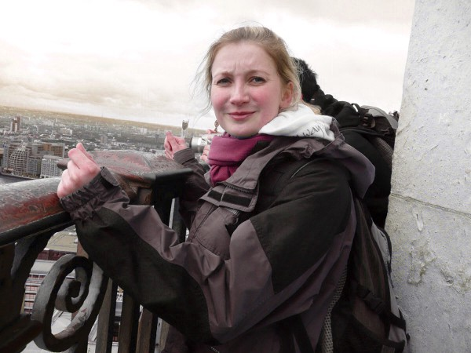

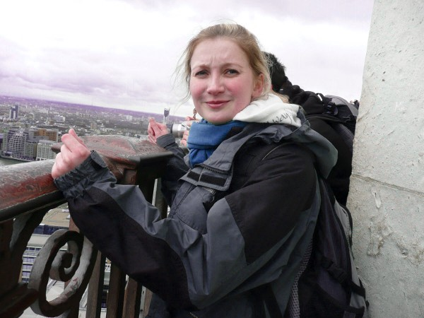

## Input images

[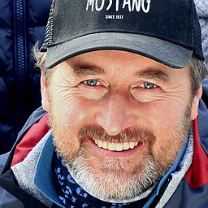](01-beard.jpg)
[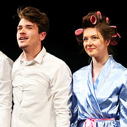](02-disk.jpg)
[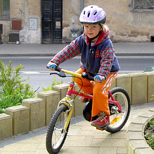](03-bicycle.jpg)

[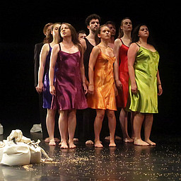](04-theater.jpg)
[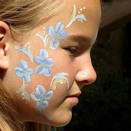](05-face.jpg)
[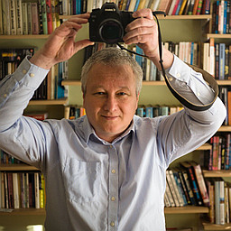](06-selfie.jpg)

[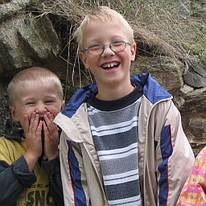](07-laugh.jpg)
[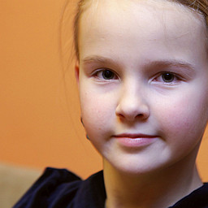](08-girl.jpg)
[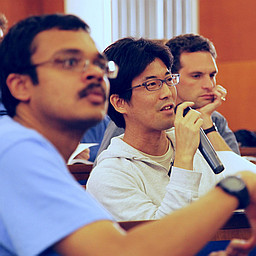](09-egsr.jpg)

[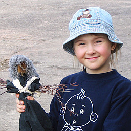](10-hat.jpg)
[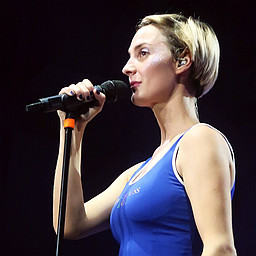](11-bara.jpg)
[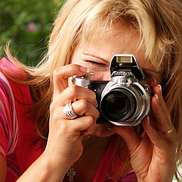](12-photographer.jpg)
