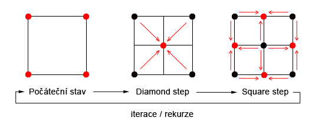
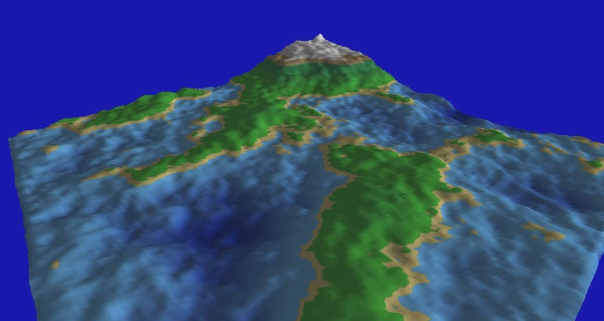

# Task 07-Terrain
Your task is to implement fractal terrain generation using a **"subdivision" algorithm**.
The 3D scene will be displayed in an interactive environment using the
[OpenGL library](https://www.opengl.org/) bound to the .NET by the
[Silk.NET library](https://github.com/dotnet/Silk.NET).

The basic idea is that you start from a **coarse mesh** (low recursion depth) and then
gradually **refine** it by subdivision steps. Each step adds new vertices and triangles
and perturbs the surface with a random displacement (scaled by a **Hausdorff
coefficient**) to obtain a fractal-like terrain.

> **Important note:** The pilot project contains simple `Up`/`Down` key handling
> (`UpdateVertex()`) only to show how to update the vertex buffer.  
> Your final solution **does not** have to support arbitrary interactive editing –
> the main task is **fractal terrain generation via subdivision** and its control
> by a few keyboard commands.

# Ideas & Details
You can find many pages dedicated to random terrain generation, for example

* [Terrain generation on vterrain.org](http://vterrain.org/Elevation/Artificial/)
* [Fractal landscape on Wikipedia](https://en.wikipedia.org/wiki/Fractal_landscape)
* One slightly outdated page:
[Terrific: Fast Terrain Rendering](https://www.cosc.brocku.ca/Offerings/4P98/gallery/projects/Winter2008/bg05he/)

I'd recommend the simple and efficient
[Diamond-square algorithm](https://en.wikipedia.org/wiki/Diamond-square_algorithm), but
you can use any algorithm that is capable of creating terrains **gradually**, by increasing
the subdivision (recursion) depth.

## Subdivision, recursion depth and Hausdorff coefficient
Your terrain is a triangle mesh. The subdivision algorithm should:

* Start from a **coarse initial mesh** (few vertices, few triangles).
* On each **subdivision step**:
  * insert new vertices (midpoints of edges, centers of squares/triangles, etc.),
  * displace them randomly in the vertical direction (or along the normal),
  * scale the displacement by a **Hausdorff coefficient** and by edge length.
* On **updivision** (reverse step), go back to a coarser mesh:
  * the number of vertices and triangles decreases,
  * a `Updivide + Subdivide` pair will typically change the terrain slightly
    (due to randomness and rounding) – that is acceptable.

Conceptually, you will have a **hierarchy of meshes**: level 0 (coarse) →
1 → 2 → …, each more detailed than the previous one.

A slightly different idea (based on triangle meshes; you can adapt it):

* For each edge, create a midpoint vertex:
  * position = average of endpoints + random vertical offset,
  * offset amplitude ~ `(edge length) * HausdorffCoefficient * Random(-1, 1)`.
* For each triangle, split into 4 smaller triangles using the edge midpoints
  (classic midpoint subdivision).
* The **Hausdorff coefficient** controls the “roughness” of the terrain –
  higher values → more jagged terrain.

## Hausdorff coefficient
The **Hausdorff coefficient** is a scalar that controls the relative amplitude of
random displacement:

* random displacement ˜ `HausdorffCoefficient * edgeLength * random(-1, 1)`.
* Larger values ? rougher, more jagged terrain.
* Smaller values ? smoother terrain.

You should allow the user to **change this coefficient interactively** and use it
during every new subdivision step.

# Commands
Use **keyboard commands** to change the terrain triangle mesh. You should implement at least
these commands:

* **Subdivide** the mesh – create a more detailed mesh. You should keep the shared vertices
  and insert new ones according to the defined **Hausdorff coefficient** (relative amplitude of the
  random displacement of the middle points).
* **Updivide** the mesh – return to the coarser mesh, so the number of vertices and triangles will
  disappear. Executing the **Updivide + Subdivide** command pair will cause the original terrain to
  change slightly.
* Change the **Hausdorff coefficient** – random subdivision of an edge should use the random value
  based on the original edge size and this coefficient.
* You should compute **normal vectors** (at the vertices) automatically. Use the `I` key to toggle the
  shading mode (Phong on/off) to see the results.
* Include all the **new keyboard commands** (hotkeys) in the `F1` help list.

Every time you **subdivide** or **updivide**, you should:

1. Rebuild or update the triangle mesh (vertices + indices) for the new recursion level.
2. **Recompute normal vectors** for all vertices (e.g., by accumulating face normals).
3. Update the vertex buffer(s) on the GPU.
4. Optionally print a message with current level and coefficient (using `Ut.Message()`).

## Suggested key mapping
For consistency, you may use the following mapping (recommended, but you can adjust if needed):

* `S` – **Subdivide** the mesh (increase recursion level).
* `U` – **Updivide** the mesh (decrease recursion level).
* `+` – Increase the **Hausdorff coefficient** (rougher terrain).
* `-` – Decrease the **Hausdorff coefficient** (smoother terrain).
* `R` – Reset to the **initial coarse mesh** and default Hausdorff coefficient.

You must:

* Implement the corresponding logic in `KeyDown(...)`.
* Print short messages using `Ut.Message()` when these actions are used
  (e.g. “Subdivide → level = 3”, “Hausdorff = 0.12”, etc.).

Existing keys from the pilot project (keep them and keep them in the `F1` help):

* `T` – toggle texture on/off.
* `I` – toggle Phong shading on/off.
* `P` – switch perspective / orthographic projection.
* `V` – toggle VSync.
* `C` – reset camera (Trackball).
* `F1` – print help (must include your new keys).
* `Esc` – quit the program.
* Mouse:
  * Left button – Trackball rotation.
  * Right button + drag – move the current object (if you keep this behavior).
  * Wheel – zoom in/out.
  * Right button double-click – close the program.

Make sure `F1` prints **all relevant commands**, both from the pilot and from your terrain logic.

# Silk.NET framework

It is easy to use [Silk.NET](https://github.com/dotnet/Silk.NET) in your C#
program, you just install the [Silk.NET NuGet package](https://www.nuget.org/packages/Silk.NET/).

You can view our sample projects in the
[Silk3D directory](../Silk3D/README.md) of our repository.

# Pilot project

There is a pilot project in this GIT directory. We wanted to show a working
OpenGL ([Silk.NET](https://www.nuget.org/packages/Silk.NET/)) project with:

* `Silk.NET.Windowing.Window`-based main program

  * window title is used for simple real-time status (see `Program.WindowTitle()`)
* command-line arguments

  * `-w`, `-h` – initial window size in pixels
  * `-t` – optional texture file (default is `:check:` = checkerboard)
* console window is kept for simple messaging (`Util.Ut.Message()`)
* [Trackball](../Silk3D/shared/Trackball.cs) support
* `class Util.FPS` is used for measuring FPS (Frames Per Second) and PPS
  (Primitives Per Second)

  * try switching "Vertical synchronization" (VSync) on and off (key `V`)!
* **keyboard** and **mouse** event handling (including simple help `F1`)

  * `KeyDown()`, `KeyUp()` for the keyboard
  * `MouseDown()`, `MouseUp()`, `MouseDoubleClick()`, `MouseMove()`, `MouseScroll()` for the mouse
* rendering of a **triangle mesh** through shared vertex/index buffers
* a minimal example of **vertex-buffer update** (`UpdateVertex()`).

Your task is to **replace** the tiny hard-coded mesh and simple `Up`/`Down`
demo with a fully functional **fractal subdivision / updivision** system.

# Rendering details
Use one large **vertex buffer (`VB`)** for storing all vertices of the mesh.
**Index buffer[s] (`IB`)** should be used to define triangles of the mesh
(three indices per triangle).

You have two options:

1. **Simple approach**  
   Either you will re-upload the **whole** `VB` and `IB` every time subdivision/updivision
   is required. This is easier to implement:
   * Rebuild the mesh (vertices + indices) in CPU memory.
   * Call `Vbo.UpdateData(...)` and `Ebo.UpdateData(...)` (or recreate buffers) to upload
     everything again.

2. **Smarter approach**  
   Or you come up with a smarter solution (e.g., you can allocate a full-sized `VB` at the beginning,
   using only sparse vertices from it, according to `IB` specific to every subdivision level).
   `VB` will be updated, but index buffers can be prepared in advance and remain constant.

In both cases:

* **Do not** read from the GPU copy of the vertex buffer – all changes should be made in CPU-side
  arrays (`vertexBuffer`, etc.) and **pushed to GPU** afterwards.
* Make sure that the vertex attribute layout in C# matches the layout in `vertex.glsl`:
  positions, colors, normals, texture coordinates.

## Normal vectors and shading

You must compute **normal vectors at vertices** automatically for each mesh level:

* After every **subdivide**/**updivide** step, recompute normals.
* A standard approach:
  * For each triangle, compute its face normal,
  * Accumulate (sum) the face normals at each vertex,
  * Normalize the sum to get the vertex normal.
* The provided **fragment shader** uses `fNormal` and the uniform `usePhong` to
  switch Phong shading on/off.
* Use the existing `I` key to toggle shading mode and inspect your normals:
  * `usePhong = false` → plain vertex color/texture,
  * `usePhong = true` → Phong shading based on normals.

Normals are crucial for a realistic appearance of the fractal terrain.

## Vertex/index buffer management

Your terrain mesh is stored in two arrays:

```csharp
private static List<uint>  indexBuffer  = new(MAX_INDICES);
private static List<float> vertexBuffer = new(MAX_VERTICES * VERTEX_SIZE);
````

You must handle these buffers whenever the mesh changes (subdivide/updivide).

Two main approaches are possible:

1. **Simple (recommended for first implementation)**

   * For each subdivision/updivision:

     * Rebuild `vertexBuffer` and `indexBuffer` from scratch,
     * Upload **entire** VB and IB to GPU using `Vbo.UpdateData(...)` and
       `Ebo.UpdateData(...)` (or by recreating the buffers).
   * This is straightforward but may be less efficient.

2. **Smarter (optional)**

   * Allocate one large **full-size VB** at the beginning,
   * Precompute **index buffers** for each subdivision level and keep them constant,
   * On subdivision/updivision:

     * Only update the parts of VB that change,
     * Switch between precomputed index ranges/buffers.
   * This can reduce the amount of data you upload per frame.

In both variants, **do not** read vertex data back from the GPU – always operate
on the CPU-side arrays and then upload to GPU.

## Pilot code: `UpdateVertex()` and locking

The pilot solution demonstrates how to safely update the vertex buffer from
the UI thread while rendering is happening in `OnRender()`:

```csharp
private static unsafe void UpdateVertex(float dy)
{
  lock (renderLock)
  {
    // change the y coordinate (offset 1) of vertex 4
    vertexBuffer[4 * VERTEX_SIZE + 1] += dy;

    var span = CollectionsMarshal.AsSpan(vertexBuffer);
    Vbo?.UpdateData(span, 4 * VERTEX_SIZE, VERTEX_SIZE);
  }
}
```

Key points:

* The `lock (renderLock)` section prevents concurrent access to the buffers from:

  * keyboard/mouse event handlers and
  * the rendering loop (`OnRender()`).
* You should use a similar locking pattern whenever you modify the mesh
  (subdivide, updivide, recompute normals, etc.).

Remember: the `Up`/`Down` keys in the pilot solution mainly serve as an **example**
of how to:

1. change vertex data on the CPU side,
2. propagate the changes to the GPU.

Your final solution will replace/extend this logic to operate on the **whole mesh**,
not just a single vertex.

## Rendering itself

The pilot project renders the terrain using:

* `PrimitiveType.Triangles`
* One shared **vertex buffer** (`Vbo`) and **index buffer** (`Ebo`)
* `Gl.DrawElements()` calls:

```csharp
Gl.DrawElements(o.Type,
                (uint)o.Indices,
                DrawElementsType.UnsignedInt,
                (void*)(o.BufferOffset * sizeof(uint)));
```

You should:

* Maintain the mesh in `vertexBuffer` (positions, colors, normals, texture coords).
* Maintain the connectivity in `indexBuffer`.
* Properly set up the **vertex attribute pointers**:
  ```csharp
  // x, y, z, R, G, B, Nx, Ny, Nz, s, t
  private const int VERTEX_SIZE = 11;

  Vao.VertexAttributePointer(0, 3, VertexAttribPointerType.Float, VERTEX_SIZE, 0);  // position
  Vao.VertexAttributePointer(1, 3, VertexAttribPointerType.Float, VERTEX_SIZE, 3);  // color
  Vao.VertexAttributePointer(2, 3, VertexAttribPointerType.Float, VERTEX_SIZE, 6);  // normal
  Vao.VertexAttributePointer(3, 2, VertexAttribPointerType.Float, VERTEX_SIZE, 9);  // texcoord
  ```

Feel free to experiment with:

* wireframe mode vs filled polygons,
* different textures (`-t` argument, key `T`),
* turning Phong shading on/off (`I`) to inspect normals.

## Vertex shader `vertex.glsl`

The vertex shader defines input quantities = vertex attributes. **It must match**
the layout of the vertex buffer:

```glsl
layout (location = 0) in vec3 vPos;
layout (location = 1) in vec3 vColor;
layout (location = 2) in vec3 vNormal;
layout (location = 3) in vec2 vTxt;
```

**Uniforms** – the shader requires three transformation matrices, applied in
the following order:

```glsl
uniform mat4 model;
uniform mat4 view;
uniform mat4 projection;
```

**Output values** – they must be in sync with the **input values of the fragment shader**:

```glsl
out vec3 fColor;
out vec2 fTxt;
out vec3 fNormal;
out vec4 fWorld;
```

Note that `fWorld` is the original **world-space position** (before the "view"
and "projection" transformations) used for shading.

See the [vertex.glsl](vertex.glsl) shader yourself if you are interested.

## Fragment shader `fragment.glsl`

A fragment shader is used for coloring the fragments (pixels). Our shader has
optional texturing (`texture()`) and optional Phong shading (actually most of
the shader code).

The output value is explicitly declared:

```glsl
out vec4 FragColor;
```

Diffuse color is chosen as:

```glsl
vec4 diffuseColor = useTexture ? texture(tex, fTxt) : vec4(fColor, 1.0);
```

Then, if `usePhong` is `true`, Blinn–Phong shading is applied using `fWorld`,
`fNormal`, and lighting uniforms.

See the [fragment.glsl](fragment.glsl) shader yourself if you are interested.

# Your solution
Please place your solution in a separate [solutions](../solutions/README.md)
directory in the repository. You'll find short instructions there.

# Launch date
**Friday 12 December 2025**
(Don't work on the solution before this date.)

# Deadline
See the shared [point table](https://docs.google.com/spreadsheets/d/17XuX5tgvh_E0u17Y4BXtQK-qVt1qnr9zAXVHGkYrNWs/edit?usp=sharing).

# Credit points
**Basic solution: 10 points**

* Variable **Hausdorff dimension** coefficient (random relative amplitude).
* Variable level of recursion (interactive **subdivide/updivide**).
* Normal vectors for basic appearance (used by Phong shading).
* Interactive terrain exploration (e.g. using the
  [Trackball class](../Silk3D/shared/Trackball.cs)).

**Bonus points: up to 16+ more points**

* Vertex color according to elevation (**2**).
* Reasonable terrain texturing (**2**).
* Initialization from height-map texture (**4**).
* Infinite terrain concept … **"periodic terrain"** (**4**).
* Hovercraft mode, interactive or scripted (**3 to 8**, depending on complexity).

## Use of AI assistant
It is possible to use an AI assistant, but you have to be critical and
test all its suggestions thoroughly.

# Images

Diagram of the diamond-square subdivision.


Example of terrain visualization using vertex colors and simple shading.
